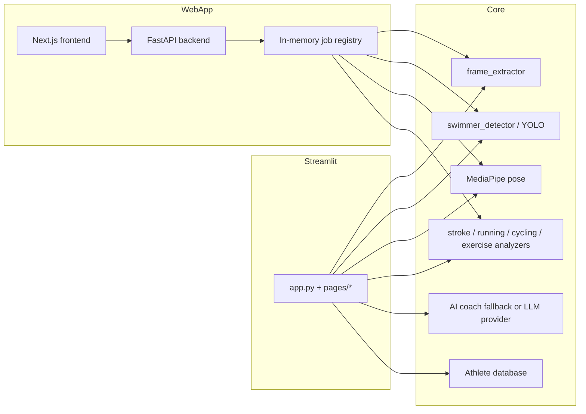

# SPRINT AI Architecture

SPRINT AI is a triathlon and rehabilitation video-analysis platform. The
repository has one primary product surface and one frozen compatibility shell.
Both use the same computer-vision and biomechanics core:

- `frontend/` — primary Next.js product UI.
- `backend/` — primary FastAPI product API.
- `app.py` and `pages/` — legacy Streamlit demo/fallback. Keep it operational,
  but do not add new product workflows there.
- `video_analysis/` — shared analysis domain: frame extraction, YOLO tracking,
  MediaPipe pose processing, sport-specific analyzers, AI coaching, reports,
  and persistence helpers.

## Runtime Flow



## Main Components

### Primary Product: Next.js + FastAPI

`frontend/` is the trainer and clinician product. It talks to FastAPI through
`NEXT_PUBLIC_BACKEND_URL`. New user journeys, persistence contracts, and
browser QA belong here.

`backend/app/main.py` exposes health, athletes, analysis, rehabilitation,
clinical, and video-tools routers. Running and swimming use the same web
contract:

1. upload a video and receive a job ID;
2. subscribe to progress and result events over Server-Sent Events;
3. review the annotated video and measured result;
4. save the completed result to a stable athlete ID;
5. read normalized, persisted sport history from the athlete overview API.

Key endpoints:

- `POST /api/analysis/{running|swimming}`
- `GET /api/analysis/{running|swimming}/{job_id}/events`
- `GET /api/analysis/{running|swimming}/{job_id}/video`
- `POST /api/analysis/{running|swimming}/{job_id}/save`
- `GET /api/athletes/{athlete_id}/sports/{sport}/overview`

The overview supports `swimming`, `running`, `cycling`, and `dryland`, but only
returns measurements that were actually persisted. Cycling and dryland do not
yet expose a web upload pipeline and their pages deliberately show capability
and readiness information instead of fabricated athlete metrics.

### Legacy Streamlit Shell

`app.py` configures the Streamlit UI and loads pages from `pages/`. This is a
legacy demo and fallback for analyzer capabilities that have not yet migrated.
Compatibility and defect fixes are allowed; new product workflows should not
be implemented here.

Legacy sport pages should still prefer cached factories from
`video_analysis/analyzer_factory.py` for heavy analyzers. Shared geometry and
smoothing helpers belong in `video_analysis/base_analyzer.py`.

### Analysis Core

`video_analysis/` is the primary domain package. The key rule is to avoid
duplicating analyzer utilities: sport analyzers inherit `BaseAnalyzer`, and new
heavy object construction should go through `analyzer_factory.py` or an
equivalent service-layer boundary.

### Persistence

There are two persistence implementations:

- Active product storage: raw SQLite in
  `video_analysis/athlete_database.py`, shared by FastAPI and Streamlit.
- Incomplete migration target: SQLAlchemy models in `video_analysis/models.py`.

Do not create a third path. Until an explicit migration is completed, new
product features must use the active database helpers and stable athlete IDs so
that all saved history remains visible through the API.

## Deployment

### Primary Web App

Use `docker-compose.yml` for the FastAPI + Next.js stack:

```bash
docker compose up --build
```

- Frontend: `http://localhost:3000`
- Backend health: `http://localhost:8000/api/health`

### Legacy Streamlit

Use the root `Dockerfile`. It runs `entrypoint.sh`, serving Streamlit on
`PORT` or `8443` by default.

## Current Limitations

- FastAPI jobs are in-memory and not durable across restarts.
- The API exposes running, swimming, rehabilitation, clinical, and video-tools
  workflows; cycling and dryland web analysis are not connected yet.
- Some API workflows still share duplicated pipeline code with `pages/`.
- Raw SQLite and ORM persistence coexist.
- Authentication, authorization, cloud synchronization, and a durable worker
  queue are not implemented. The current deployment target is a trusted local
  pilot, not an internet-facing multi-user service.
