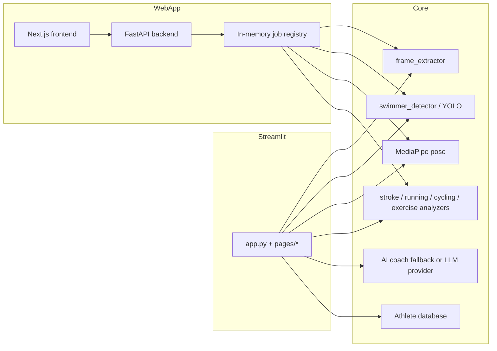

# SPRINT AI Architecture

SPRINT AI is a triathlon video-analysis platform. The current repository has
two application shells that share the same computer-vision and biomechanics
core:

- `app.py` and `pages/` — Streamlit prototype and trainer-facing fallback UI.
- `backend/` — FastAPI API for the new web app.
- `frontend/` — Next.js UI for the new web app.
- `video_analysis/` — shared analysis domain: frame extraction, YOLO tracking,
  MediaPipe pose processing, sport-specific analyzers, AI coaching, reports,
  and persistence helpers.

## Runtime Flow



## Main Components

### Streamlit Shell

`app.py` configures the seven-tab UI and loads pages from `pages/`. This path is
still the broadest UI surface: swimming, running, cycling, dryland, athlete
history, AI assistant, and video tools.

Sport pages should prefer cached factories from
`video_analysis/analyzer_factory.py` for heavy analyzers. Shared geometry and
smoothing helpers belong in `video_analysis/base_analyzer.py`.

### FastAPI Backend

`backend/app/main.py` wires health, athlete, and analysis routers. The current
production-ready analysis endpoint is running upload + Server-Sent Events:

1. `POST /api/analysis/running` validates and stores a video upload.
2. A background thread runs `backend/app/services/running.py`.
3. `GET /api/analysis/running/{job_id}/events` streams progress and final data.
4. `GET /api/analysis/running/{job_id}/video` serves the annotated MP4.

The job registry is intentionally in-memory for Phase 1. It is single-process
only and should be replaced by a durable queue before multi-worker deployment.

### Next.js Frontend

`frontend/` is the new trainer UI. It talks to FastAPI through
`NEXT_PUBLIC_BACKEND_URL`, uploads running videos, subscribes to SSE progress,
and renders the annotated result video.

### Analysis Core

`video_analysis/` is the primary domain package. The key rule is to avoid
duplicating analyzer utilities: sport analyzers inherit `BaseAnalyzer`, and new
heavy object construction should go through `analyzer_factory.py` or an
equivalent service-layer boundary.

### Persistence

There are two persistence layers:

- Active Streamlit backend: raw SQLite in `video_analysis/athlete_database.py`.
- Migration target: SQLAlchemy models in `video_analysis/models.py`.

New API-facing work should prefer the ORM path, but existing Streamlit pages
still depend on raw SQLite. A migration plan should consolidate these paths
before athlete history becomes a shared web feature.

## Deployment

### Streamlit

Use the root `Dockerfile`. It runs `entrypoint.sh`, serving Streamlit on
`PORT` or `8443` by default.

### Web App

Use `docker-compose.yml` for the FastAPI + Next.js stack:

```bash
docker compose up --build
```

- Frontend: `http://localhost:3000`
- Backend health: `http://localhost:8000/api/health`

## Current Limitations

- FastAPI jobs are in-memory and not durable across restarts.
- Only running analysis is exposed through the new API.
- Athlete endpoints in `backend/app/api/athletes.py` are still stubbed.
- Raw SQLite and ORM persistence coexist.
- Some Streamlit pages still contain page-local tracking pipelines that should
  gradually move into service modules.
