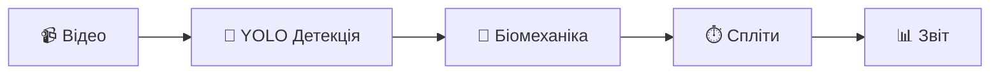

# 🏊‍♂️ Sprint Bot — AI Video Analysis for Swimming

[](https://www.python.org/downloads/)
[](https://opensource.org/licenses/MIT)

**Професійний аналіз техніки плавання з штучним інтелектом**



---

## ✨ Можливості

| Функція | Опис |
|---------|------|
| 🎯 **Velocity Tracking** | Передбачення руху для точного трекінгу швидких плавців |
| 🌊 **Підводна детекція** | Бачить плавця навіть під водою (4 рівні детекції) |
| 🔬 **Біомеханіка** | 33 точки тіла, кути суглобів, вісь хребта |
| ⏱️ **Точні спліти** | За реальним timestamp відео (±0.001 сек) |
| 📹 **FPS до 60** | Повна розкадровка для детального аналізу |
| 🎨 **Веб-інтерфейс** | Streamlit з українською мовою |

---

## 🚀 Швидкий старт

### Встановлення

```bash
# Клонуємо
git clone https://github.com/Kachalaba/Advanced-Swimming-Training-Bot-with-AI-features.git
cd Advanced-Swimming-Training-Bot-with-AI-features

# Віртуальне середовище
python3 -m venv venv
source venv/bin/activate

# Залежності
pip install -r requirements.txt
```

### Запуск веб-інтерфейсу

```bash
python3 -m streamlit run app.py
```

Відкрийте: **http://localhost:8501**

### Запуск з командного рядка

```bash
python examples/run_local_video_analysis.py \
  --video path/to/video.mp4 \
  --output ./outputs \
  --fps 15 \
  --pool-length 25
```

---

## 📁 Структура проекту

```
├── app.py                      # 🎨 Streamlit веб-інтерфейс
├── video_analysis/             # 🎬 Модулі аналізу
│   ├── frame_extractor.py      # Витягування кадрів
│   ├── swimmer_detector.py     # YOLO + Velocity Tracking
│   ├── biomechanics_analyzer.py# MediaPipe поза
│   ├── split_analyzer.py       # Спліти та швидкість
│   ├── trajectory_analyzer.py  # Аналіз траєкторії
│   ├── video_overlay.py        # Анотоване відео
│   └── report_generator.py     # PDF/JSON звіти
├── bot.py                      # 🤖 Telegram бот
├── docs/                       # 📚 Документація
└── requirements.txt            # 📦 Залежності
```

---

## 📊 Приклад результатів

```json
{
  "splits": [
    {"distance": 25, "time": 12.54, "speed": 1.99, "pace": 50.2}
  ],
  "biomechanics": {
    "posture_score": 78.5,
    "drag_coefficient": 0.42,
    "streamline_score": 85.2
  }
}
```

---

## 🔧 Налаштування FPS

| FPS | Час | Використання |
|-----|-----|--------------|
| 5-10 | ⚡ 1-2 хв | Швидкий перегляд |
| 10-15 | 🔄 2-3 хв | Тренування |
| 30-60 | 🎯 10-20 хв | Фінальний аналіз |

---

## 🛠️ Технології

- **Python 3.8+**
- **YOLO** (Ultralytics) — детекція плавця
- **MediaPipe** — поза тіла (33 точки)
- **OpenCV** — обробка відео
- **Streamlit** — веб-інтерфейс
- **PyTorch** — deep learning

---

## 📚 Документація

- [📖 Посібник користувача](docs/USER_GUIDE.md)
- [🏗️ Архітектура](ARCHITECTURE.md)
- [📝 Історія змін](CHANGELOG.md)

---

## 🤝 Внесок

1. Fork репозиторію
2. Створіть branch (`git checkout -b feature/amazing`)
3. Commit (`git commit -m 'Add amazing feature'`)
4. Push (`git push origin feature/amazing`)
5. Відкрийте Pull Request

---

## 📄 Ліцензія

MIT License — див. [LICENSE](LICENSE)

---

**Створено з ❤️ для спортсменів та тренерів** 🏊‍♂️
