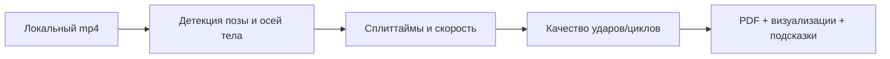

# Sprint-Bot — ИИ-видеоанализ плавания

Sprint-Bot сфокусирован только на видеоаналитике: вы локально запускаете скрипт, загружаете mp4, а движок автоматически извлекает метрики техники в реальном времени — без Telegram и облачных зависимостей.

## Ключевые возможности

- 🎯 **Загрузка и обработка mp4.** Локальная загрузка видео, извлечение кадров и анализ до полной дистанции.
- 📍 **Оси тела и ключевые точки.** Детекция позы пловца с разметкой продольной/поперечной оси и контроль углов корпуса и головы.
- 🏁 **Сплиты и скорость.** Автоопределение реакции старта, касаний на поворотах и построение кривой скорости.
- 🤿 **Положение тела.** Визуализация биомеханических линий (голова, плечо, таз, колено, стопа) поверх кадра.
- 🦶 **Удары ногами и циклы.** Подсчёт ударов на выходах и в цикле, оценка скорости и продвижения за удар/цикл.
- 🌀 **Траектория гребков.** Трекинг руки в трёх фазах (вход, захват, протяжка) с подсказками по корректировке траектории.
- 📈 **Отчёты.** Аннотированные кадры, график скорости, PDF/PNG с ключевыми метриками и рекомендациями.

## Как запустить

1. Установите зависимости: `pip install -r requirements.txt` и `pip install -r video_analysis/requirements.txt` (YOLO/pose/визуализации).
2. Подготовьте пути к моделям и директории логов в `.env` или передавайте их в параметры своих скриптов.
3. Запускайте локальный скрипт, используя API из `video_analysis` (пример ниже), без Telegram-бота или внешних сервисов.
4. На выходе получите аннотированные кадры, кривую скорости и PDF/PNG-отчёт рядом с исходным видео.

## Архитектура

- `video_analysis/frame_extractor.py` — извлечение кадров с настраиваемым FPS.
- `video_analysis/swimmer_detector.py` — детекция пловца и ключевых точек (YOLO/pose).
- `video_analysis/split_analyzer.py` — поиск старта/поворотов, сплиты, частота гребков, кривая скорости.
- `video_analysis/report_generator.py` — сбор метрик в графики, текст и PDF.
_Исключено_: Telegram-хендлеры и чат-логика — движок предназначен для локального запуска ваших скриптов.

## Контроль качества

- `make format` (isort + black)
- `make lint` (ruff + mypy)
- `make test` (pytest)

Sprint-Bot создан для локального видеоанализа: вы контролируете запуск, модели и вывод, а результатом остаются кадры и цифры, без лишних чатов и таблиц.
