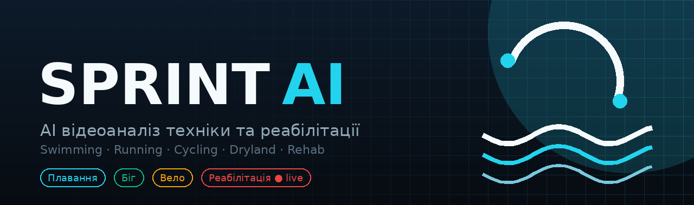
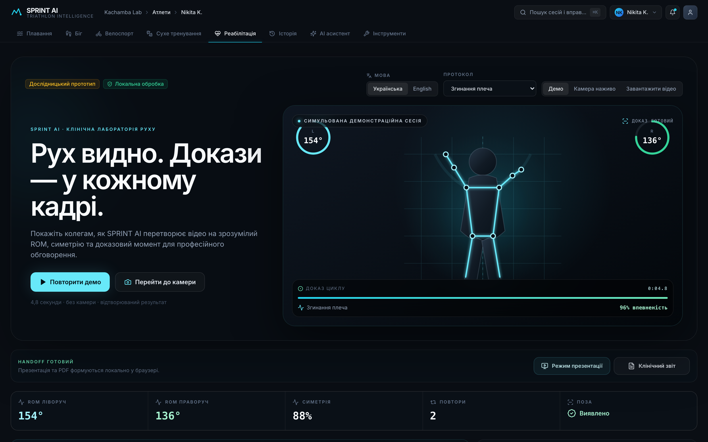
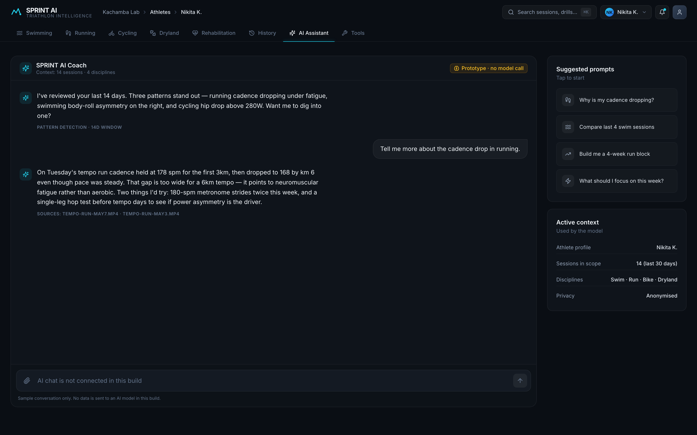
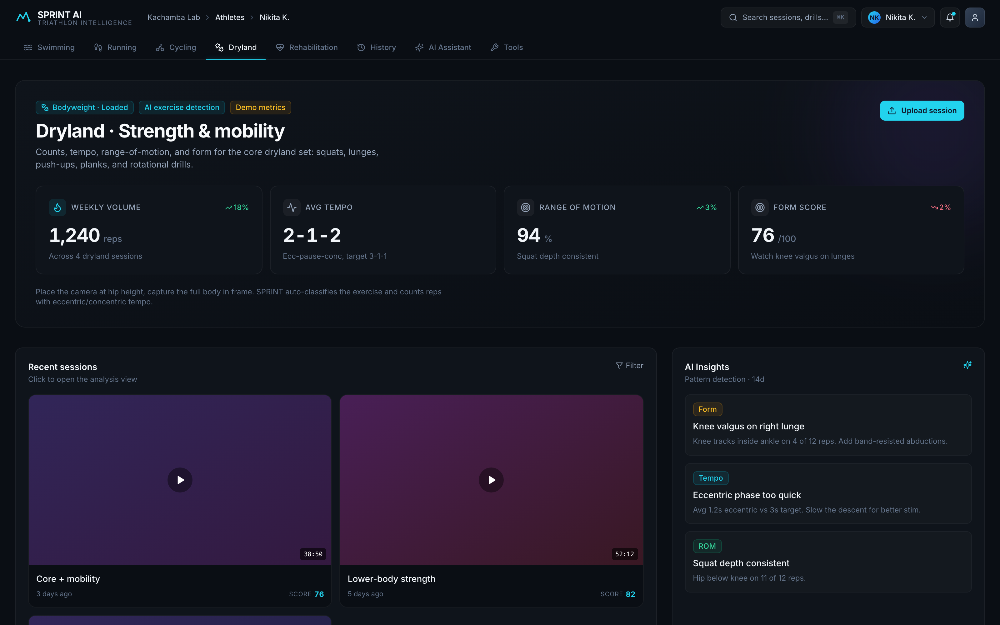

<p align="center">
  
</p>

<p align="center">
  <a href="https://opensource.org/licenses/MIT"></a>
  
  
  
  
</p>

<p align="center"><b>Камера замість лабораторії.</b> SPRINT AI перетворює звичайне відео з телефона чи вебкамери на клінічну біомеханіку для <b>плавання, бігу, велоспорту, силових вправ і реабілітації</b> — за лічені секунди.</p>

---

## 💡 Навіщо це

Раніше, щоб розібрати техніку чи прогрес відновлення, потрібні були дорогі
датчики, лабораторія або «око» тренера й секундомір. SPRINT AI робить це
**з одного відео**: сам знаходить людину, бачить кожен суглоб і пояснює
зрозумілою мовою — що добре, що ні, над чим працювати.

> 🎯 Один інструмент для тренерів із тріатлону, плавання, легкої атлетики,
> фітнесу — **та фізичних терапевтів**.

## 📸 Як це виглядає

Преміальний темний інтерфейс (Next.js 16 / React 19), що відкривається на
**http://localhost:3000** після `docker compose up`:

<table>
  <tr>
    <td width="50%" valign="top">
      <br/>
      <b>🩺 Жива реабілітація</b> — постуральна карта, ROM L/R, симетрія та відносне калібрування кута камери у реальному часі.
    </td>
    <td width="50%" valign="top">
      <br/>
      <b>🤖 AI-тренер</b> — чат на базі Claude з контекстом усіх сесій атлета; дані анонімізуються перед відправкою.
    </td>
  </tr>
  <tr>
    <td colspan="2" valign="top">
      <br/>
      <b>🤸 Суходіл</b> — дизайн-напрямок модуля. Web-аналіз ще підключається; інтерфейс не показує вигаданих вимірювань.
    </td>
  </tr>
</table>

---

## 🩺 Флагман: блок «Реабілітація»

Режим відновлення руху (кінезіотерапія) прямо у браузері — для роботи з плечем,
ліктем, стегном і коліном після травм. **Працює наживо з вебкамери.**

<table>
<tr><td width="34%"><b>📹 Live-камера</b></td><td>Аналіз у реальному часі, без завантаження файлів</td></tr>
<tr><td><b>🦴 Постуральна карта</b></td><td>Осі плечей, таза й корпусу з підсвічуванням перекосів — прямо поверх відео</td></tr>
<tr><td><b>📐 Амплітуда руху (ROM)</b></td><td>Скільки градусів реально «проходить» суглоб — окремо ліворуч і праворуч</td></tr>
<tr><td><b>⚖️ Симетрія L/R</b></td><td>Наскільки одна сторона відстає від іншої — ключове у відновленні</td></tr>
<tr><td><b>🎚️ Калібрування камери</b></td><td>Нахилений телефон? Система врахує кут і не зіпсує вимірювання</td></tr>
<tr><td><b>🖥️ Повний екран</b></td><td>Зручно для занять; вихід клавішею <code>Esc</code></td></tr>
<tr><td><b>💾 Історія</b></td><td>Кожне заняття лягає в картку атлета — видно прогрес тиждень за тижнем</td></tr>
<tr><td><b>⚡ Швидкість</b></td><td>Потік оптимізовано під сучасні ноутбуки (тестовано на MacBook Air M4)</td></tr>
</table>

Також працює **аналіз завантаженого відео**: обираєте вправу → відео зі
скелетом, графіки ROM і підсумок із симетрією.

> ⚕️ SPRINT AI — тренувальний помічник, а не медичний прилад; не замінює огляд
> лікаря чи фізичного терапевта.

### Clinical Pilot Mode

Локальний кабінет фахівця на
`/rehabilitation/clinical` перетворює окреме вимірювання на послідовний
клінічний робочий процес:

1. профіль пацієнта прив'язується до конкретного запису спортсмена;
2. курс відновлення фіксує протокол, функціональну ціль і цільовий ROM;
3. візит проходить через контекст, readiness, аналіз, перевірку та фіналізацію;
4. quality gate блокує неповні дані або вимагає явного підтвердження обмежень;
5. прогрес порівнюється з baseline і попереднім валідним вимірюванням;
6. Clinical Handoff Pack формується українською або англійською та друкується
   у PDF через системний діалог браузера.

Клінічні записи й відеосесії зберігаються лише в локальній SQLite-базі. У
пілоті немає хмарної синхронізації, багатокористувацького доступу або
авторизації. Це дослідницький прототип для професійного обговорення руху, а не
медичний виріб і не система постановки діагнозу.

Повний сценарій, резервне копіювання та чекліст демонстрації:
[Clinical Pilot Guide](docs/clinical-pilot.md).

---

## 🏆 Що вже працює у web-продукті

| Дисципліна | Поточний стан |
|---|---|
| 🏊 **Плавання** | Завантаження відео, waterline-aware аналіз, annotated video, збереження атлету й реальна історія |
| 🏃 **Біг** | Завантаження відео, каденс, постановка стопи, симетрія рук, annotated video, збереження й порівняння сесій |
| 🩺 **Реабілітація** | Live-камера та upload, ROM L/R, симетрія, quality gate, прогрес і Clinical Handoff Pack |
| 🧰 **Відеоінструменти** | Обрізання, витяг кадрів, прогрес задачі та збереження результату |
| 🚴 **Велосипед** | Analyzer core існує; web upload і доказовий результат ще не підключені |
| 🤸 **Суходіл** | Exercise analyzer існує; web capture і збереження історії ще не підключені |

---

## 🚀 Запуск за 1 хвилину

Потрібен лише [Docker Desktop](https://www.docker.com/products/docker-desktop/).

```bash
docker compose up --build       # → відкрий http://localhost:3000
```

**🖥️ Ярлик на робочому столі (macOS)** — запуск подвійним кліком з іконкою:

```bash
bash scripts/install-macos-launcher.sh
```

<details>
<summary><b>Альтернатива: класичний інтерфейс (Streamlit)</b></summary>

```bash
python3 -m venv venv && source venv/bin/activate
pip install -r requirements.txt
python3 -m streamlit run app.py        # → http://localhost:8501
```
Тут доступні всі 8 вкладок із повним набором функцій.
</details>

---

## 🧠 Як це працює «під капотом»

```
1. Знаходимо людину на кожному кадрі  →  YOLOv8 + lock-on трекінг
2. Будуємо скелет із 33 точок         →  MediaPipe + згладжування (EMA)
3. Рахуємо біомеханіку                →  кути, ROM, симетрія, фази руху
4. Пояснюємо людською мовою           →  звіт, графіки, поради AI-тренера
```

Основний продукт — **Next.js + FastAPI**. Класичний **Streamlit** залишається
замороженим legacy/demo-інтерфейсом для сумісності. Обидва використовують один
«движок» аналізу (`video_analysis/`).

---

## 🛠️ Стек і розробка

`Python` · `YOLOv8` · `MediaPipe` · `OpenCV` · `FastAPI` · `Server-Sent Events` ·
`Next.js 16` · `React 19` · `TailwindCSS` · `SQLite/SQLAlchemy` · `Claude API` ·
`Docker` · `GitHub Actions`.

```bash
pytest tests/unit/ -v       # тести движка та бекенду
make lint                   # ruff + black + isort + mypy
cd frontend && npm run lint && npm run test
```

Документація: [Архітектура](ARCHITECTURE.md) · [Налаштування](SETUP.md) ·
[Clinical Pilot](docs/clinical-pilot.md) ·
[Лаунчер macOS](docs/macos-launcher.md) · [Історія змін](CHANGELOG.md)

---

## 🗺️ Дорожня карта

- [x] Web-пайплайни плавання та бігу з annotated video і збереженням атлету
- [x] База атлетів і реальна історія спортивних сесій
- [x] Темний web-застосунок (Next.js + FastAPI)
- [x] **Реабілітація: ROM, симетрія, відео + live-камера, постуральна карта**
- [x] **Clinical Pilot: пацієнти, курси, quality gate, прогрес і handoff-звіт**
- [ ] Спільний перемикач української / English для всього web-продукту
- [ ] Перенесення велосипеда / суходолу у web-пайплайн
- [ ] Durable job queue, authentication і контроль доступу
- [ ] Інтеграція Garmin / Strava, календар тренувань

---

<p align="center">
  <sub><b>Створено для тренерів, фізичних терапевтів і спортсменів.</b></sub><br>
  <sub>MIT License · Плавання · Біг · Велосипед · Суходіл · Реабілітація</sub>
</p>
