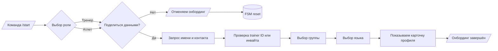
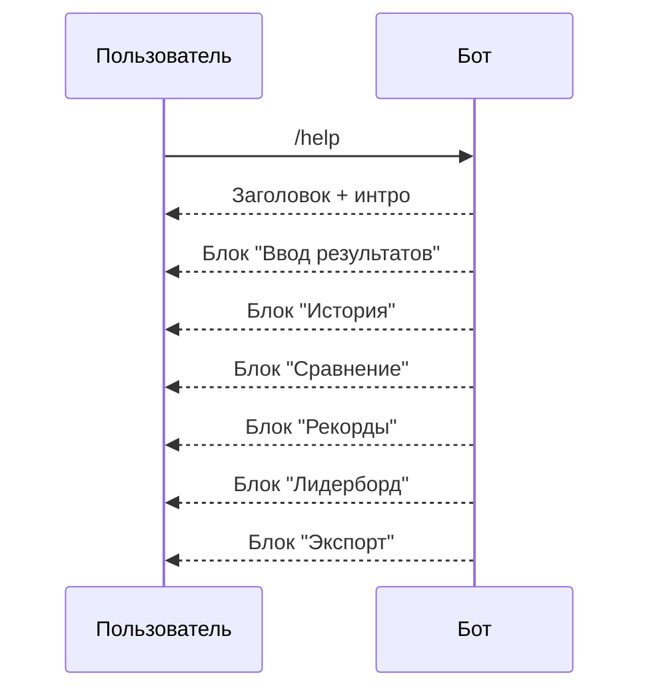
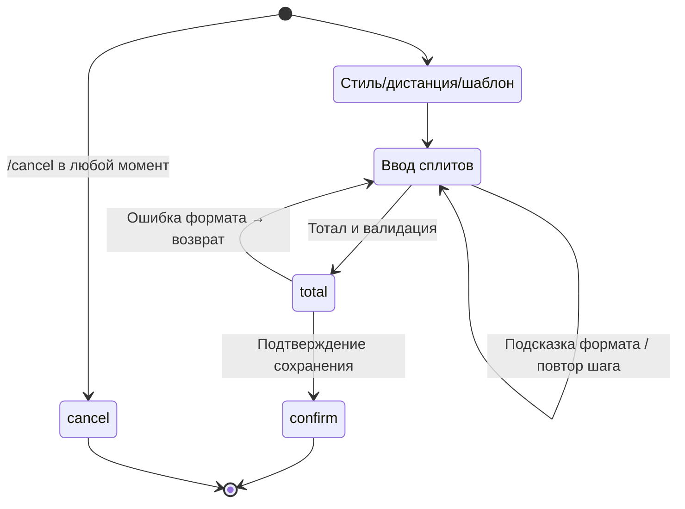

# Sprint Bot Scenario Playbook

## Web Product: Dryland Analysis
- **Entry point**: `/dryland` opens the dark SPRINT AI sport landing page with real athlete history, not demo metrics.
- **Exercise selection**: athlete/clinician must choose `Squat`, `Lunge`, or `Push-up` before upload. The selected profile controls the backend metric target and avoids guessing the exercise from noisy pose data.
- **Capture guidance**: fixed side view, full body visible, no cropped joints, complete ready -> effort -> ready repetitions.
- **Quality gate**: clips with too few metric-ready frames or low pose coverage are rejected with reshoot guidance instead of producing a weak score.
- **Result page**: `/dryland/{jobId}` shows annotated evidence video, confirmed reps, tempo, ROM, stability, pose coverage, metric-ready frames, and a per-rep table.
- **History**: successful jobs can be saved to an athlete and then appear in the dryland sport overview.

## /start Onboarding
- **Happy path**: роль → приватность → имя → тренер → группа → язык → карточка профиля.
- **Защита**: отказ приватности сбрасывает состояние и отзывает инвайт; неверные trainer-ID/инвайты дают подсказки.
- **Сценарные тесты**: `tests/test_onboarding_flow.py` покрывает happy-path, отказ приватности и deep-link-инвайт.

## /help Справка
- Сообщение разбито на блоки: ввод, история, сравнение, рекорды, лидерборд, экспорт.
- Строки локализованы (uk/ru) и проверяются в `tests/test_bot_i18n.py`.
- Хэндлер не требует состояний — доступен всегда, безопасен к спаму.

## Мастер ввода сплитов
- Шаги: стиль/дистанция → шаблон → сплиты → тотал → подтверждение.
- Поддерживает форматы `mm:ss.ss`, `см/мс`, `repeat/cancel`, автосумму и выравнивание.
- Тесты (`tests/test_add_wizard.py`, `tests/test_add_wizard_i18n.py`) закрывают happy-path, отмену, повтор и ошибки формата.

